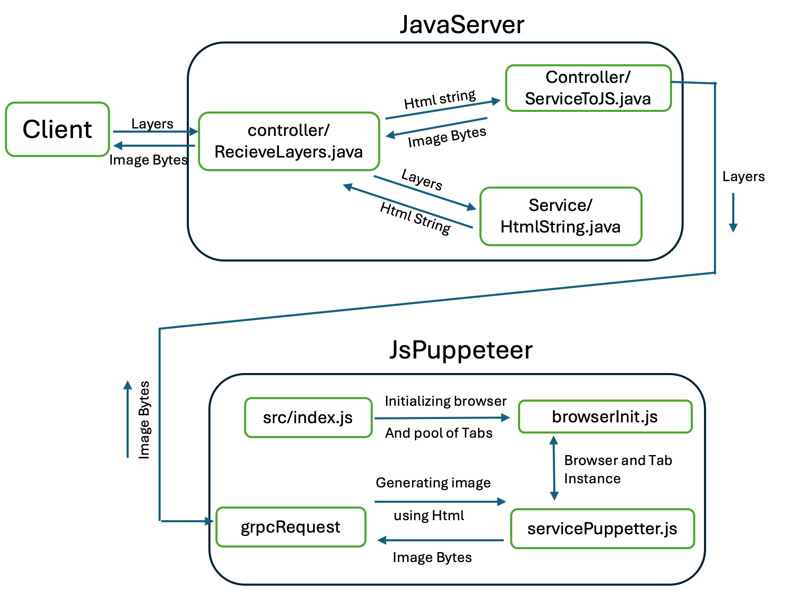

# Image Editor with Layers

This repository contains two interconnected projects designed to work together to provide an image editing service using layers information. The projects are:

1. **JavaServer** - A backend service built with Spring Boot.
2. **Js Puppeteer** - A Node.js service using Puppeteer for image generation.

## Overview

The image editor allows clients to send layer information, which is processed to generate an image. The architecture leverages gRPC for inter-service communication between the JavaServer and the Js Puppeteer service.

## Technology Stack

- **Java (Spring Boot)**
- **Node.js**
- **gRPC** - For inter-service communication
- **Puppeteer** - For generating images using layer information

## Architecture Flow

1. **Client Request**: The client sends layer information to the JavaServer using gRPC services.
2. **HTML String Construction**: The JavaServer constructs an HTML string from the layer information.
3. **gRPC Communication**: The HTML string is sent to the Js Puppeteer service via gRPC.
4. **Image Generation**: The Js Puppeteer service uses Puppeteer to generate an image based on the HTML string.
5. **Image Response**: The generated image is sent back to the JavaServer via gRPC.
6. **Client Response**: The JavaServer returns the generated image to the client.



### Setting Up JavaServer

1. **Clone the repository**:
   ```bash
   git clone https://github.com/cheekuag/ImageProcessing.git
   cd ImageProcessing/JavaServer

2. **Build the project**: `./gradlew build`
3. **Run the server**:  `./gradlew bootRun`

### Setting Up JsPuppeteer

1. **Clone the repository**:
   ```bash
   git clone https://github.com/cheekuag/ImageProcessing.git
   cd ImageProcessing/JsPuppeteer

2. **Install dependencies**: `npm install`
3. **Run the service**:  `node src/index.js`

### Setting Up Docker Environment

1. **Create Docker Network**: `docker network create my-network`

2. **Running JsPuppeteer Service**
   
   1. **Build JsPuppeteer Docker Image**
    
      `cd ImageProcessing/Js\ Puppeteer/`
      
      `docker build -t jspuppeteer .`
   3. **Run JsPuppeteer Container**
    
      `docker run --network my-network --name Js-container jspuppeteer`

3. **Running JavaServer Service**
   
   1.**Build JavaServer Docker Image**

   `cd ImageProcessing/JavaServer`
   
   `docker build -t java-server .`

   2.**Run JavaServer Container**
   
      `docker run --network my-network --name Java-container -p 9090:9090 java-server`


